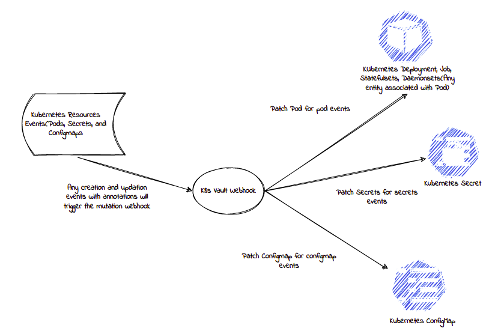

#################
K8s Vault Webhook
#################

.. image:: _static/images/k8s-vault-webhook-logo.svg
    :align: center
    :alt: logo

k8s-vault-webhook is a Kubernetes admission webhook which listen for the events related to Kubernetes resources for injecting secret directly from secret manager to pod, secret, and configmap. The motive of creating this project is to provide a dynamic secret injection to containers/pods running inside Kubernetes from different secret managers for enhanced security.

The secret managers which are currently supported:-

- `Hashicorp Vault <https://www.vaultproject.io/>`__ 

There are some secret managers which are planned to be implemented in future.

- `AWS Secret Manager <https://aws.amazon.com/secrets-manager/>`__ 
- `Azure Key Vault <https://azure.microsoft.com/en-in/services/key-vault/>`__ 
- `GCP Secret Manager <https://cloud.google.com/secret-manager>`__ 

Supported Features
==================

- Authentication to Hashicorp vault using Kubernetes service-account
- RBAC implementation of vault using different policies of vault and association of policy with service-account
- Inject secret directly to pods/containers running inside Kubernetes
- Support regex to inject all secrets from a certain path of Vault
- Inject secrets directly to the process of container, i.e. after the injection you cannot read secrets from the environment variable

Architecture
============

.. toctree::
    :caption: Getting Started
    :maxdepth: 2
    :hidden:

    getting_started.rst

