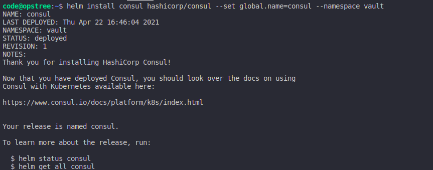
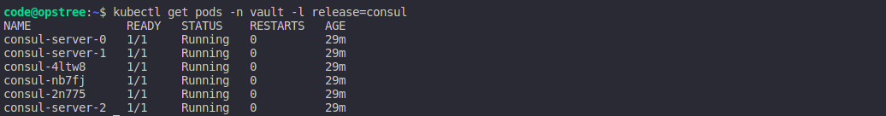
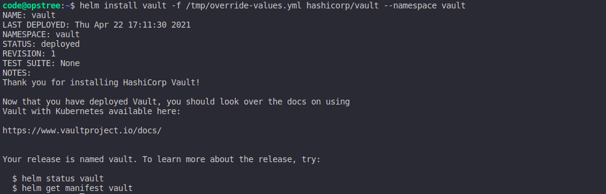
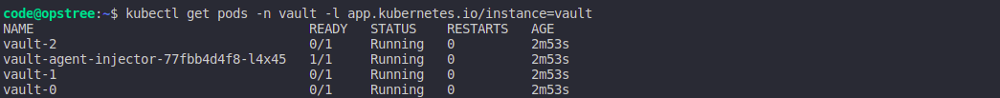
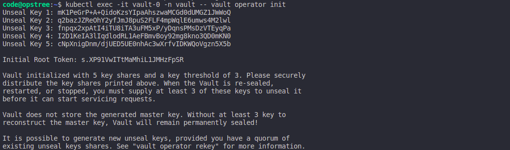
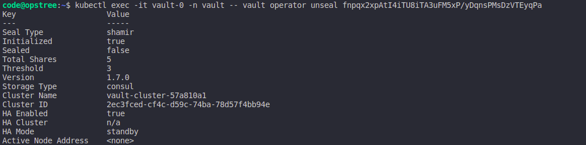

.. _vault_setup:

Vault Setup
===========

Vault is a tool for securely accessing secrets. A secret is anything that you want to tightly control access to, such as API keys, passwords, or certificates. Vault provides a unified interface to any secret, while providing tight access control and recording a detailed audit log.

A modern system requires access to a multitude of secrets: database credentials, API keys for external services, credentials for service-oriented architecture communication, etc. Understanding who is accessing what secrets is already very difficult and platform-specific. Adding on key rolling, secure storage, and detailed audit logs is almost impossible without a custom solution.

But before setting up Vault, we have to setup a key-value store for it. We are going to use `Hashicorp Consul <https://consul.io/>`__ for our datastore.

Add the HashiCorp Helm Repository:

.. code:: bash

    $ helm repo add hashicorp https://helm.releases.hashicorp.com
    "hashicorp" has been added to your repositories

Ensure you have access to the consul chart:

.. code:: bash

    $ helm search repo hashicorp/consul
    NAME                CHART VERSION   APP VERSION DESCRIPTION
    hashicorp/consul    0.20.1          1.7.2       Official HashiCorp Consul Chart

Now you're ready to install Consul! To install Consul with the default configuration using Helm 3 run:

.. code:: bash

    $ helm install consul hashicorp/consul --set global.name=consul --namespace vault

Let's verify the consul pods.

.. code:: bash

    $ kubectl get pods -n vault -l release=consul

Once the consul cluster is ready, let's try to install vault cluster with HA mode. Also we will change the datastore of vault to consul.

.. code:: bash

    $ cat << EOF > ./override-values.yaml
    server:
      ha:
        enabled: true
        replicas: 3
        config: |
          ui = true

          listener "tcp" {
              tls_disable = 1
              address = "[::]:8200"
              cluster_address = "[::]:8201"
          }

          storage "consul" {
              path = "vault"
              address = "consul-server:8500"
          }
    EOF

.. code:: bash

    $ helm install vault -f override-values.yaml hashicorp/vault --namespace vault

.. code:: bash

    $ kubectl get pods -n vault -l release=vault

**Note:- You will see your vault pods are not in Ready state because vault is still sealed. We need to unseal it before using it.**

.. code:: bash

    $ kubectl exec -it vault-0 -n vault -- vault operator init
    Unseal Key 1: mK1PeGrP+A+QidoKzsYIpaAhszwaMCGd0dUMGZ1JWWoQ
    Unseal Key 2: q2bazJZReOhY2yfJmJ8puS2FLF4mpWqlE6umws4M2lwl
    Unseal Key 3: fnpqx2xpAtI4iTU8iTA3uFM5xP/yDqnsPMsDzVTEyqPa
    Unseal Key 4: I2D1KeIA3lIqdlodRL1AeFBmvBoy92mg8kno3QD0mKN0
    Unseal Key 5: cNpXnigDnm/djUED5UE0nhAc3wXrfvIDKWQoVgzn5X5b

    Initial Root Token: s.XP91VwITtMaMhiL1JMHzFpSR

    Vault initialized with 5 key shares and a key threshold of 3. Please securely
    distribute the key shares printed above. When the Vault is re-sealed,
    restarted, or stopped, you must supply at least 3 of these keys to unseal it
    before it can start servicing requests.

    Vault does not store the generated master key. Without at least 3 key to
    reconstruct the master key, Vault will remain permanently sealed!

    It is possible to generate new unseal keys, provided you have a quorum of
    existing unseal keys shares. See "vault operator rekey" for more information.

**Save the output at a special secure place, because this will be required to login in Vault as root user. Use first three unseal tokens to unseal the vault.**

.. code:: bash

    $ kubectl exec -it vault-0 -n vault -- vault operator unseal mK1PeGrP+A+QidoKzsYIpaAhszwaMCGd0dUMGZ1JWWoQ
    $ kubectl exec -it vault-0 -n vault -- vault operator unseal q2bazJZReOhY2yfJmJ8puS2FLF4mpWqlE6umws4M2lwl
    $ kubectl exec -it vault-0 -n vault -- vault operator unseal fnpqx2xpAtI4iTU8iTA3uFM5xP/yDqnsPMsDzVTEyqPa

.. code:: bash

    $ kubectl exec -it vault-1 -n vault -- vault operator unseal mK1PeGrP+A+QidoKzsYIpaAhszwaMCGd0dUMGZ1JWWoQ
    $ kubectl exec -it vault-1 -n vault -- vault operator unseal q2bazJZReOhY2yfJmJ8puS2FLF4mpWqlE6umws4M2lwl
    $ kubectl exec -it vault-1 -n vault -- vault operator unseal fnpqx2xpAtI4iTU8iTA3uFM5xP/yDqnsPMsDzVTEyqPa

.. code:: bash

    $ kubectl exec -it vault-2 -n vault -- vault operator unseal mK1PeGrP+A+QidoKzsYIpaAhszwaMCGd0dUMGZ1JWWoQ
    $ kubectl exec -it vault-2 -n vault -- vault operator unseal q2bazJZReOhY2yfJmJ8puS2FLF4mpWqlE6umws4M2lwl
    $ kubectl exec -it vault-2 -n vault -- vault operator unseal fnpqx2xpAtI4iTU8iTA3uFM5xP/yDqnsPMsDzVTEyqPa

The pods will become ready as soon as vault is unsealed.

.. code:: bash

    $ kubectl get pods -n vault -l app.kubernetes.io/instance=vault
    NAME                                    READY   STATUS    RESTARTS   AGE
    vault-agent-injector-77fbb4d4f8-l4x45   1/1     Running   0          18m
    vault-0                                 1/1     Running   0          18m
    vault-1                                 1/1     Running   0          18m
    vault-2                                 1/1     Running   0          18m
