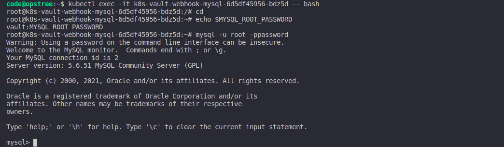

.. _webhook_installation:

Webhook Installation
====================

k8s-vault-webhook can easily get installed by using `Helm <https://helm.sh/>`__ . We just simple need to add the repository of our `helm charts <https://github.com/OT-CONTAINER-KIT/helm-charts>`__ .

If you want to pass your custom values file while installing the chart, you can find the values file 
`here <https://github.com/OT-CONTAINER-KIT/helm-charts/blob/main/charts/k8s-vault-webhook/values.yaml>`__ 

.. code:: bash

    $ helm repo add ot-helm https://github.com/OT-CONTAINER-KIT/helm-charts

    $ helm upgrade k8s-vault-webhook ot-helm/k8s-vault-webhook --namespace vault --install

    $ kubectl get pods -n vault

Let's test the setup using deploying a MySQL using `example <https://github.com/OT-CONTAINER-KIT/k8s-vault-webhook/tree/master/example>`__ .

.. code:: bash

    $ kubectl apply -f example/mysql-deployment.yaml
    $ kubectl get pods

