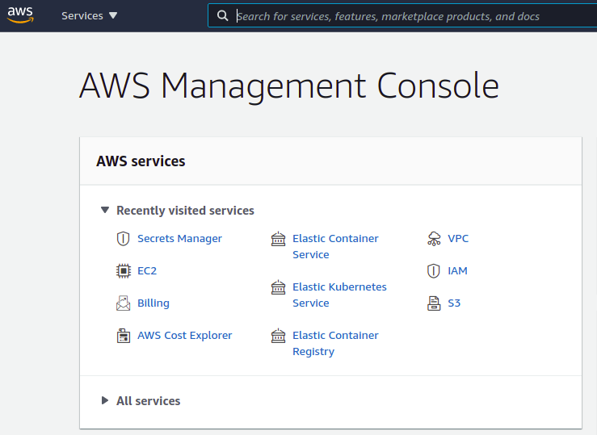
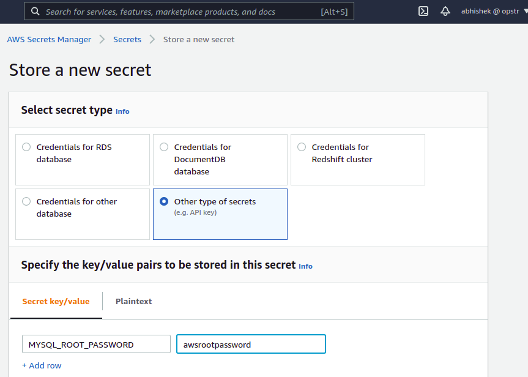
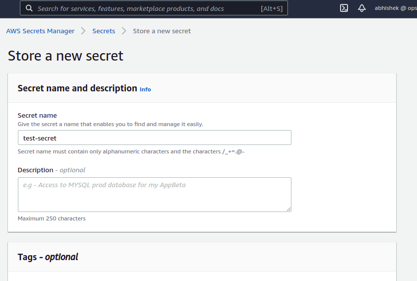

# AWS Secret Manager

For integrating AWS Secret Manager with the K8s Vault Webhook, first we need to setup AWS Secret Manager inside AWS account.

Here we will talk about the integration of AWS Secret Manager inside Kubernetes.

## Secret Manager Setup

Login into the [AWS Management Console](https://console.aws.amazon.com/console/home?nc2=h_ct&src=header-signin) and select [AWS Secret Manager](https://aws.amazon.com/secrets-manager/) service.

Create a secret in the secret-manager and select the secret type `Other type of secrets` and specify the key value pairs with these details.

|**Key**|**Value**|
|-------|---------|
| MYSQL_ROOT_PASSWORD | awspassword |

You should provide and description as well to the secret.

Create the secret after all configuration to use it inside Kubernetes.
