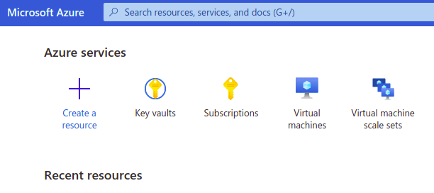

# Azure Key Vault

For integrating AWS Secret Manager with the K8s Vault Webhook, first we need to setup Azure Key Vault inside Azure account.

Here we will talk about the integration of Azure Key Vault inside Kubernetes.

Login into the [Azure Portal](http://portal.azure.com/#home) and select [Azure Key Vault](https://azure.microsoft.com/en-in/services/key-vault/) service.

Create a secret in Settings > Secrets and click on `Generate/Import` ans specify these details for testing.

|**Key**|**Value**|
|-------|---------|
| mysql-root-password | azurepassword |

Once the details has been provided, create the secret.

**Since Azure Key Vault doesn't supports underscore `_`, we will use hyphen `-`. The k8s-vault-webhook will automatically replace the hyphen with underscore.**
