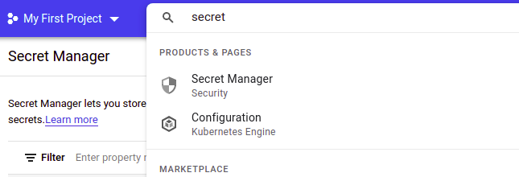
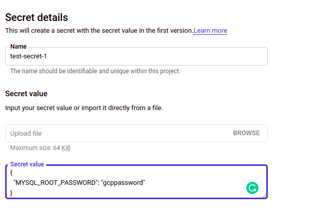

# GCP Secret Manager

For integrating GCP Secret Manager with the K8s Vault Webhook, first we need to setup GCP Secret Manager inside GCP account.

Here we will talk about the integration of GCP Secret Manager inside Kubernetes.

Login into the [GCP Portal](https://console.cloud.google.com/) and select [GCP Secret Manager](https://console.cloud.google.com/security/secret-manager) service.



Create a secret by clicking on **Create Secret** and provide a JSON key value pair in the secret data like this:-

```json
{
  "MYSQL_ROOT_PASSWORD": "gcppassword"
}
```



Once the secret details has been provided, create the secret.

**We can provide multiple key-value in form on JSON data**
