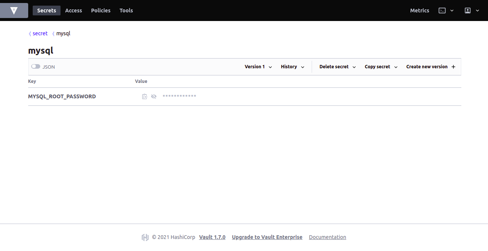

# Hashicorp Vault

For integrating Hashicorp Vault with the K8s Vault Webhook, first we need to setup Hashicorp Vault inside or outside the Kubernetes cluster.

Here we will talk about the integration of Vault inside Kubernetes.

## Consul Setup

But before setting up Vault, we have to setup a key-value store for it. We are going to use [Hashicorp Consul](https://consul.io/) for our datastore.

Add the HashiCorp Helm Repository:

```shell
$ helm repo add hashicorp https://helm.releases.hashicorp.com
...
"hashicorp" has been added to your repositories
```

Ensure you have access to the consul chart:

```shell
$ helm search repo hashicorp/consul
...
NAME                CHART VERSION   APP VERSION DESCRIPTION
hashicorp/consul    0.20.1          1.7.2       Official HashiCorp Consul Chart
```

Now you’re ready to install Consul! To install Consul with the default configuration using Helm 3 run:

```shell
$ helm install consul hashicorp/consul \
    --set global.name=consul --namespace vault
...
LAST DEPLOYED: Mon May  3 20:57:16 2021
NAMESPACE: vault
STATUS: deployed
REVISION: 1
NOTES:
Thank you for installing HashiCorp Consul!

Now that you have deployed Consul, you should look over the docs on using 
Consul with Kubernetes available here: 

https://www.consul.io/docs/platform/k8s/index.html


Your release is named consul.

To learn more about the release, run:

  $ helm status consul
  $ helm get all consul
```

Let’s verify the consul pods.

```shell
$ kubectl get pods -n vault -l release=consul
...
NAME              READY   STATUS    RESTARTS   AGE
consul-server-2   1/1     Running   0          50s
consul-server-0   1/1     Running   0          50s
consul-server-1   1/1     Running   0          50s
consul-5crwc      1/1     Running   0          51s
consul-k4hn5      1/1     Running   0          51s
consul-jldb8      1/1     Running   0          51s
```

## Vault Setup

Once the consul cluster is ready, let’s try to install vault cluster with HA mode. Also we will change the datastore of vault to consul.

```shell
$ cat << EOF > ./override-values.yaml
server:
  ha:
    enabled: true
    replicas: 3
    config: |
      ui = true

      listener "tcp" {
          tls_disable = 1
          address = "[::]:8200"
          cluster_address = "[::]:8201"
      }

      storage "consul" {
          path = "vault"
          address = "consul-server:8500"
      }
EOF
```

```shell
$ helm install vault -f override-values.yaml \
    hashicorp/vault --namespace vault
...
NAME: vault
LAST DEPLOYED: Mon May  3 21:00:37 2021
NAMESPACE: vault
STATUS: deployed
REVISION: 2
TEST SUITE: None
NOTES:
Thank you for installing HashiCorp Vault!

Now that you have deployed Vault, you should look over the docs on using
Vault with Kubernetes available here:

https://www.vaultproject.io/docs/


Your release is named vault. To learn more about the release, try:

  $ helm status vault
  $ helm get manifest vault
```

```shell
$ kubectl get pods -n vault -l app.kubernetes.io/instance=vault
...
NAME                                    READY   STATUS    RESTARTS   AGE
vault-agent-injector-77fbb4d4f8-mwngm   1/1     Running   0          30m
vault-2                                 0/1     Running   0          2m24s
vault-0                                 0/1     Running   0          2m24s
vault-1                                 0/1     Running   0          2m24s
```

**Note:- You will see your vault pods are not in Ready state because vault is still sealed. We need to unseal it before using it.**

```shell
$ kubectl exec -it vault-0 -n vault -- vault operator init
...
Unseal Key 1: mK1PeGrP+A+QidoKzsYIpaAhszwaMCGd0dUMGZ1JWWoQ
Unseal Key 2: q2bazJZReOhY2yfJmJ8puS2FLF4mpWqlE6umws4M2lwl
Unseal Key 3: fnpqx2xpAtI4iTU8iTA3uFM5xP/yDqnsPMsDzVTEyqPa
Unseal Key 4: I2D1KeIA3lIqdlodRL1AeFBmvBoy92mg8kno3QD0mKN0
Unseal Key 5: cNpXnigDnm/djUED5UE0nhAc3wXrfvIDKWQoVgzn5X5b

Initial Root Token: s.XP91VwITtMaMhiL1JMHzFpSR

Vault initialized with 5 key shares and a key threshold of 3. Please securely
distribute the key shares printed above. When the Vault is re-sealed,
restarted, or stopped, you must supply at least 3 of these keys to unseal it
before it can start servicing requests.

Vault does not store the generated master key. Without at least 3 key to
reconstruct the master key, Vault will remain permanently sealed!

It is possible to generate new unseal keys, provided you have a quorum of
existing unseal keys shares. See "vault operator rekey" for more information.
```

**Note:- Save the output at a special secure place, because this will be required to login in Vault as root user. Use first three unseal tokens to unseal the vault.**

```shell
$ kubectl exec -it vault-0 -n vault \
    -- vault operator unseal mK1PeGrP+A+QidoKzsYIpaAhszwaMCGd0dUMGZ1JWWoQ
$ kubectl exec -it vault-0 -n vault \
    -- vault operator unseal q2bazJZReOhY2yfJmJ8puS2FLF4mpWqlE6umws4M2lwl
$ kubectl exec -it vault-0 -n vault \
    -- vault operator unseal fnpqx2xpAtI4iTU8iTA3uFM5xP/yDqnsPMsDzVTEyqPa
...
Key                    Value
---                    -----
Seal Type              shamir
Initialized            true
Sealed                 false
Total Shares           5
Threshold              3
Version                1.7.0
Storage Type           consul
Cluster Name           vault-cluster-57a810a1
Cluster ID             2ec3fced-cf4c-d59c-74ba-78d57f4bb94e
HA Enabled             true
HA Cluster             n/a
HA Mode                standby
Active Node Address    <none>
```

**Repeat the same unseal steps for vault-1 and vault-2 as well**

The pods will become ready as soon as vault is unsealed.

```shell
$ kubectl get pods -n vault -l app.kubernetes.io/instance=vault
...
NAME                                    READY   STATUS    RESTARTS   AGE
vault-agent-injector-77fbb4d4f8-l4x45   1/1     Running   0          18m
vault-0                                 1/1     Running   0          18m
vault-1                                 1/1     Running   0          18m
vault-2                                 1/1     Running   0          18m
```

## Vault Configuration

For Vault configuration, we are going to use vault-cli and vault-ui both. Download and install vault-cli on your local system. It can be downloaded from [here](https://www.vaultproject.io/downloads).

First, forward the port of vault to your local system.

```shell
$ kubectl port-forward vault-0 8200:8200 -n vault
...
Forwarding from 127.0.0.1:8200 -> 8200
Forwarding from [::1]:8200 -> 8200
```

Login into the vault using the root token which we got using init command.

```shell
$ export VAULT_ADDR=http://127.0.0.1:8200
$ vault login
...
Token (will be hidden): 
Success! You are now authenticated. The token information displayed below
is already stored in the token helper. You do NOT need to run "vault login"
again. Future Vault requests will automatically use this token.

Key                  Value
---                  -----
token                s.XP91VwITtMaMhiL1JMHzFpSR
token_accessor       dK1rauoPrf0nNxMb8wRfwz1i
token_duration       ∞
token_renewable      false
token_policies       ["root"]
identity_policies    []
policies             ["root"]
```

Enable the Kubernetes auth backend in the vault cluster

```shell
$ vault auth enable kubernetes
...
Success! Enabled kubernetes auth method at: kubernetes/
```

Create a file with name `vault-reviewer.yaml` which will have the service-account and cluster role access information.

```yaml
---
apiVersion: v1
kind: ServiceAccount
metadata:
  name: vault-reviewer
  namespace: vault
---
apiVersion: rbac.authorization.k8s.io/v1beta1
kind: ClusterRoleBinding
metadata:
  name: role-tokenreview-binding
  namespace: vault
roleRef:
  apiGroup: rbac.authorization.k8s.io
  kind: ClusterRole
  name: system:auth-delegator
subjects:
- kind: ServiceAccount
  name: vault-reviewer
  namespace: vault
```

```shell
$ kubectl apply -f vault-reviewer.yaml
```

Configure Vault with the vault-reviewer token and Kubernetes CA to fetch secrets.

```shell
$ VAULT_SA_TOKEN_NAME=$(kubectl get sa vault-reviewer -n vault -o jsonpath="{.secrets[*]['name']}")

$ SA_JWT_TOKEN=$(kubectl get secret -n vault "$VAULT_SA_TOKEN_NAME" -o jsonpath="{.data.token}" | base64 --decode; echo)

$ SA_CA_CRT=$(kubectl get secret -n vault "$VAULT_SA_TOKEN_NAME" -o jsonpath="{.data['ca\.crt']}" | base64 --decode; echo)
```

```shell
$ vault write auth/kubernetes/config token_reviewer_jwt="$SA_JWT_TOKEN" kubernetes_host=https://kubernetes.default kubernetes_ca_cert="$SA_CA_CRT"
...
Success! Data written to: auth/kubernetes/config
```

Create a policy in vault for Kubernetes to read the secrets.

```hcl
path "secret/*" {
  capabilities = ["read", "list"]
}
```

```shell
$ vault policy write k8s_policy policy.hcl
```

Create a service-account which can be associated with the application pod to fetch the secrets.

```shell
$ kubectl create sa tester
```

Associate the role to service-account.

```shell
$ vault write auth/kubernetes/role/tester \
  bound_service_account_names=tester \
  bound_service_account_namespaces=default \
  policies=k8s_policy \
  ttl=1h
```

Let’s try to put some secret inside Vault.

```shell
$ vault kv put secret/mysql MYSQL_ROOT_PASSWORD=password
```


