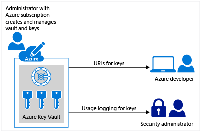

# Secret Manager

Secrets management refers to the tools and methods for managing digital authentication credentials (secrets), including passwords, keys, APIs, and tokens for use in applications, services, privileged accounts and other sensitive parts of the IT ecosystem.

While secrets management is applicable across an entire enterprise, the terms “secrets” and “secrets management” are referred to more commonly in IT with regard to DevOps environments, tools, and processes.

Some popular secret managers are:-

- **[Hashicorp Vault](https://www.vaultproject.io/)**
- **[AWS Secret Manager](https://aws.amazon.com/secrets-manager/)**
- **[Azure Key Vault](https://azure.microsoft.com/en-in/services/key-vault/)**
- **[GCP Secret Manager](https://cloud.google.com/secret-manager)**

## Hashicorp Vault

Vault is a tool for securely accessing secrets. A secret is anything that you want to tightly control access to, such as API keys, passwords, or certificates. Vault provides a unified interface to any secret, while providing tight access control and recording a detailed audit log.

A modern system requires access to a multitude of secrets: database credentials, API keys for external services, credentials for service-oriented architecture communication, etc. Understanding who is accessing what secrets is already very difficult and platform-specific. Adding on key rolling, secure storage, and detailed audit logs is almost impossible without a custom solution.

Vault comes with various pluggable components called secrets engines and authentication methods allowing you to integrate with external systems. The purpose of those components is to manage and protect your secrets in dynamic infrastructure (e.g. database credentials, passwords, API keys).

## AWS Secret Manager

AWS Secrets Manager helps you protect secrets needed to access your applications, services, and IT resources. The service enables you to easily rotate, manage, and retrieve database credentials, API keys, and other secrets throughout their lifecycle.

## Azure Key Vault

Azure Key Vault is cloud service to securely store and accessing credentials such as API Keys, passwords, certificates or cryptographic keys.

    

## GCP Secret Manager

GCP Secret Manager is a secure and convenient storage system for API keys, passwords, certificates, and other sensitive data. Secret Manager provides a central place and single source of truth to manage, access, and audit secrets across Google Cloud.
