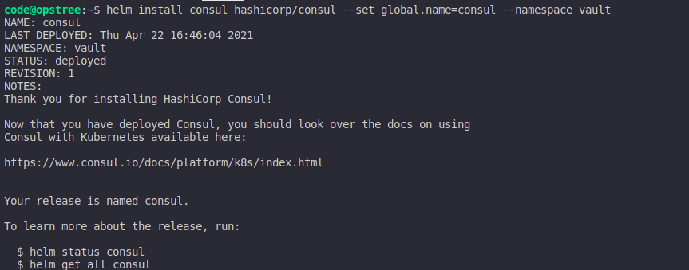

# Vault Setup

Vault is a tool for securely accessing secrets. A secret is anything that you want to tightly control access to, such as API keys, passwords, or certificates. Vault provides a unified interface to any secret, while providing tight access control and recording a detailed audit log.

A modern system requires access to a multitude of secrets: database credentials, API keys for external services, credentials for service-oriented architecture communication, etc. Understanding who is accessing what secrets is already very difficult and platform-specific. Adding on key rolling, secure storage, and detailed audit logs is almost impossible without a custom solution.

## Consul

But before setting up Vault, we have to setup a key-value store for it. We are going to use [Hashicorp Consul](https://consul.io/) for our datastore.

Add the HashiCorp Helm Repository:

```shell
$ helm repo add hashicorp https://helm.releases.hashicorp.com
"hashicorp" has been added to your repositories
```

Ensure you have access to the consul chart:

```shell
$ helm search repo hashicorp/consul
NAME                CHART VERSION   APP VERSION DESCRIPTION
hashicorp/consul    0.20.1          1.7.2       Official HashiCorp Consul Chart
```

Now you’re ready to install Consul! To install Consul with the default configuration using Helm 3 run:

```shell
$ helm install consul hashicorp/consul \
    --set global.name=consul --namespace vault
```



Let’s verify the consul pods.

```shell
$ kubectl get pods -n vault -l release=consul
```


## Vault

Once the consul cluster is ready, let’s try to install vault cluster with HA mode. Also we will change the datastore of vault to consul.

```shell
$ cat << EOF > ./override-values.yaml
server:
  ha:
    enabled: true
    replicas: 3
    config: |
      ui = true

      listener "tcp" {
          tls_disable = 1
          address = "[::]:8200"
          cluster_address = "[::]:8201"
      }

      storage "consul" {
          path = "vault"
          address = "consul-server:8500"
      }
EOF
```

```shell
$ helm install vault -f override-values.yaml \
    hashicorp/vault --namespace vault
```


```shell
$ kubectl get pods -n vault -l release=vault
```


**Note:- You will see your vault pods are not in Ready state because vault is still sealed. We need to unseal it before using it.**

```shell
$ kubectl exec -it vault-0 -n vault -- vault operator init
Unseal Key 1: mK1PeGrP+A+QidoKzsYIpaAhszwaMCGd0dUMGZ1JWWoQ
Unseal Key 2: q2bazJZReOhY2yfJmJ8puS2FLF4mpWqlE6umws4M2lwl
Unseal Key 3: fnpqx2xpAtI4iTU8iTA3uFM5xP/yDqnsPMsDzVTEyqPa
Unseal Key 4: I2D1KeIA3lIqdlodRL1AeFBmvBoy92mg8kno3QD0mKN0
Unseal Key 5: cNpXnigDnm/djUED5UE0nhAc3wXrfvIDKWQoVgzn5X5b

Initial Root Token: s.XP91VwITtMaMhiL1JMHzFpSR

Vault initialized with 5 key shares and a key threshold of 3. Please securely
distribute the key shares printed above. When the Vault is re-sealed,
restarted, or stopped, you must supply at least 3 of these keys to unseal it
before it can start servicing requests.

Vault does not store the generated master key. Without at least 3 key to
reconstruct the master key, Vault will remain permanently sealed!

It is possible to generate new unseal keys, provided you have a quorum of
existing unseal keys shares. See "vault operator rekey" for more information.
```


**Note:- Save the output at a special secure place, because this will be required to login in Vault as root user. Use first three unseal tokens to unseal the vault.**

```shell
$ kubectl exec -it vault-0 -n vault -- vault operator unseal mK1PeGrP+A+QidoKzsYIpaAhszwaMCGd0dUMGZ1JWWoQ
$ kubectl exec -it vault-0 -n vault -- vault operator unseal q2bazJZReOhY2yfJmJ8puS2FLF4mpWqlE6umws4M2lwl
$ kubectl exec -it vault-0 -n vault -- vault operator unseal fnpqx2xpAtI4iTU8iTA3uFM5xP/yDqnsPMsDzVTEyqPa
```

```shell
$ kubectl exec -it vault-1 -n vault -- vault operator unseal mK1PeGrP+A+QidoKzsYIpaAhszwaMCGd0dUMGZ1JWWoQ
$ kubectl exec -it vault-1 -n vault -- vault operator unseal q2bazJZReOhY2yfJmJ8puS2FLF4mpWqlE6umws4M2lwl
$ kubectl exec -it vault-1 -n vault -- vault operator unseal fnpqx2xpAtI4iTU8iTA3uFM5xP/yDqnsPMsDzVTEyqPa
```

```shell
$ kubectl exec -it vault-2 -n vault -- vault operator unseal mK1PeGrP+A+QidoKzsYIpaAhszwaMCGd0dUMGZ1JWWoQ
$ kubectl exec -it vault-2 -n vault -- vault operator unseal q2bazJZReOhY2yfJmJ8puS2FLF4mpWqlE6umws4M2lwl
$ kubectl exec -it vault-2 -n vault -- vault operator unseal fnpqx2xpAtI4iTU8iTA3uFM5xP/yDqnsPMsDzVTEyqPa
```


The pods will become ready as soon as vault is unsealed.

```shell
$ kubectl get pods -n vault -l app.kubernetes.io/instance=vault
NAME                                    READY   STATUS    RESTARTS   AGE
vault-agent-injector-77fbb4d4f8-l4x45   1/1     Running   0          18m
vault-0                                 1/1     Running   0          18m
vault-1                                 1/1     Running   0          18m
vault-2                                 1/1     Running   0          18m
```
